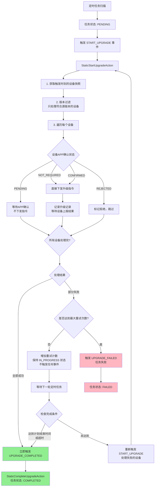
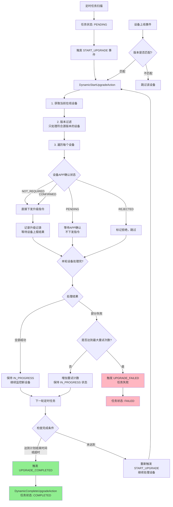
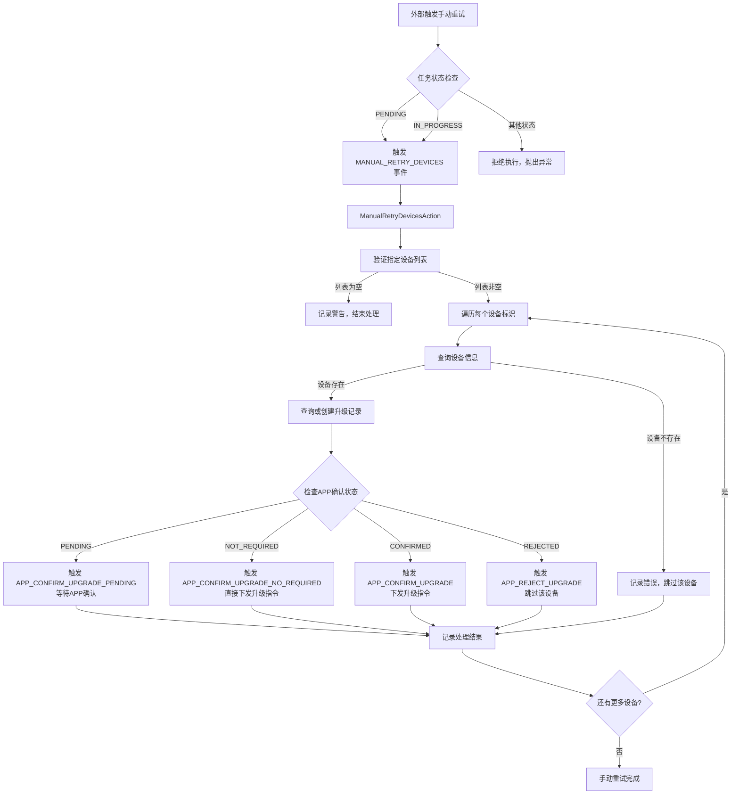

# OTA升级系统流程说明

## 📋 系统概述

OTA (Over-The-Air) 升级系统用于远程升级IoT设备的固件或软件。系统采用**COLA状态机**管理升级任务的生命周期，支持**静态升级**
和**动态升级**两种模式。

---

## 核心概念

### 1. 升级模式对比

| 特性         | 静态升级          | 动态升级        |
|------------|---------------|-------------|
| **设备范围**   | 触发时刻的设备快照     | 持续监控在线设备    |
| **处理方式**   | 一次性批量处理       | 持续处理新上线设备   |
| **完成时机**   | 所有设备处理完成后立即结束 | 达到计划结束时间后结束 |
| **设备上线事件** | 不监听           | 监听并处理       |
| **使用场景**   | 固定范围设备批量升级    | 持续升级新上线设备   |

### 2. 任务状态流转

```
PENDING (待处理)
    ↓
IN_PROGRESS (进行中)
    ↓
COMPLETED (已完成) / FAILED (失败) / CANCELLED (已取消)
```

---

## 静态升级流程



### 关键点说明：

1. **设备快照**：升级开始时获取设备列表，后续不再增加新设备
2. **立即完成**：所有设备处理成功后，无需等待结束时间，立即完成任务
3. **重试机制**：失败时增加重试次数并保持 `IN_PROGRESS` 状态，由定时任务自动重试
4. **兜底完成**：如果任务一直未完成，达到计划结束时间后强制完成

---

## 动态升级流程



### 关键点说明：

1. **持续处理**：任务一直保持 `IN_PROGRESS` 状态，持续监控和处理设备
2. **设备上线监听**：监听设备上线事件，新设备上线时自动触发升级
3. **不立即完成**：即使本轮所有设备处理成功，也不触发完成事件，继续等待新设备
4. **时间控制完成**：只有达到计划结束时间或超时，才触发 `UPGRADE_COMPLETED` 事件

---

## 手动重试指定设备流程



### 手动重试关键点说明：

#### 1. **与常规升级流程的区别**

| 对比项 | 常规升级（START_UPGRADE） | 手动重试指定设备 |
|--------|--------------------------|-----------------|
| **触发方式** | 定时任务自动触发 | 外部API手动触发 |
| **设备获取** | 从升级范围策略获取 | 直接使用指定的设备列表 |
| **版本过滤** | 进行版本过滤 | 不进行版本过滤 |
| **重复下发** | 已下发成功的设备跳过 | 允许重复下发 |
| **状态影响** | 影响任务整体状态和重试计数 | 不影响任务整体状态和重试计数 |
| **执行条件** | 任务为 PENDING 或 IN_PROGRESS | 任务为 PENDING 或 IN_PROGRESS |

#### 2. **状态机转换规则**

- **PENDING → IN_PROGRESS**：外部转换，任务从待处理状态开始执行手动重试
- **IN_PROGRESS → IN_PROGRESS**：内联转换，任务在进行中状态下重试指定设备

#### 3. **使用场景**

- 设备升级失败后需要单独重试
- 设备未收到升级指令需要重新下发
- 升级过程中断需要恢复特定设备
- 部分设备网络波动导致指令丢失

#### 4. **注意事项**

- 只能在 `PENDING` 或 `IN_PROGRESS` 状态下执行
- 设备列表中的设备标识将被逐一处理
- APP确认状态为 `PENDING` 或 `REJECTED` 的设备会被跳过，不会下发指令
- 允许对已下发成功的设备重新下发指令
- 执行结果不影响任务的整体状态和重试计数
- 设备信息不存在时会记录错误并跳过该设备

---

## 完整状态机流转图

```
                    ┌─────────────────────────────────┐
                    │    OTA升级任务状态机流转图         │
                    └─────────────────────────────────┘

          ┌─────────────────────────────────────────────────┐
          │                                                 │
    ┌─────▼────┐                                      ┌─────┴──────┐
    │  PENDING │                                      │   FAILED   │
    └─────┬────┘                                      └─────▲──────┘
          │                                                 │
          │ START_UPGRADE                        UPGRADE_FAILED
          │                                    (达到最大重试次数)
          ▼                                                 │
    ┌──────────────┐                                       │
    │ IN_PROGRESS  ├───────────────────────────────────────┘
    └──────┬───────┘
           │
           ├──► UPGRADE_COMPLETED ───► COMPLETED (成功完成)
           │    • 静态升级：所有设备处理完成后
           │    • 动态升级：达到计划结束时间或超时
           │    • 兜底：任何升级达到结束时间
           │
           ├──► MANUAL_CANCEL ───────► CANCELLED (手动取消)
           │
           └──► TIMEOUT ─────────────► FAILED (超时失败)


═══════════════════════════════════════════════════════════════
               IN_PROGRESS 状态内的内部循环
               (状态不变，重复执行)
───────────────────────────────────────────────────────────────

    START_UPGRADE
        • 处理新设备(动态升级)
        • 重试失败设备(静态/动态升级)

    MANUAL_RETRY_DEVICES (手动重试指定设备)
        • 外部API触发
        • 直接处理指定的设备列表
        • 不进行版本过滤
        • 允许重复下发指令
        • 不影响任务整体状态

    设备相关事件(仅动态升级):
        • DEVICE_ONLINE (设备上线)
        • DEVICE_OFFLINE (设备离线)

    APP确认事件:
        • APP_CONFIRM_UPGRADE_PENDING (等待确认)
        • APP_CONFIRM_UPGRADE_NO_REQUIRED (无需确认)
        • APP_CONFIRM_UPGRADE (确认)
        • APP_REJECT_UPGRADE (拒绝)

═══════════════════════════════════════════════════════════════
```

---

## 重试机制详解

### 重试决策流程

```
设备处理失败
    ↓
记录错误信息到 context
    ↓
检查: retryCount < maxRetryCount ?
    │
    ├─ YES ──► context.incrementRetryCount()
    │          updateTaskRetryCount()
    │          保持 IN_PROGRESS 状态
    │          不触发任何事件
    │               ↓
    │          等待下一轮定时任务
    │               ↓
    │          自动重新触发 START_UPGRADE
    │               ↓
    │          重新处理失败的设备
    │
    └─ NO ───► fireEvent(UPGRADE_FAILED)
                   ↓
               任务状态变更为 FAILED
```

### 重要说明

- **重试不改变状态**：重试时任务保持 `IN_PROGRESS` 状态，不触发状态转换
- **计数器递增**：每次重试前必须调用 `incrementRetryCount()` 增加计数
- **定时任务驱动**：重试由定时任务自动触发，不需要手动干预
- **失败阈值**：达到 `maxRetryCount` 后触发 `UPGRADE_FAILED` 事件，任务最终失败

---

## APP确认机制

### APP确认状态说明

| 状态             | 说明      | 是否下发指令 |
|----------------|---------|--------|
| `PENDING`      | 等待APP确认 | ❌ 否    |
| `NOT_REQUIRED` | 无需APP确认 | ✅ 是    |
| `CONFIRMED`    | APP已确认  | ✅ 是    |
| `REJECTED`     | APP拒绝   | ❌ 否    |

### 确认流程

```
设备升级记录创建
    ↓
检查是否需要APP确认
    │
    ├─ 需要确认 ──► 状态: PENDING
    │                  ↓
    │              等待APP操作
    │                  ↓
    │              APP确认/拒绝
    │                  ↓
    │              更新记录状态
    │                  ↓
    │              下一轮定时任务处理
    │
    └─ 无需确认 ──► 状态: NOT_REQUIRED
                       ↓
                   直接下发升级指令
```

---

## 核心类职责说明

| 类名                                   | 职责                | 关键方法                                                          |
|--------------------------------------|-------------------|---------------------------------------------------------------|
| `OtaUpgradeTaskExecutionServiceImpl` | 任务执行协调器，定时扫描和执行任务 | `otaUpgradeTasksExecute()`, `executeUpgradeTask()`, `executeUpgradeTaskWithDevices()` |
| `OtaUpgradeStateMachineConfig`       | 状态机配置，定义所有状态转换规则  | `dynamicUpgradeStateMachine()`, `staticUpgradeStateMachine()` |
| `BaseOtaUpgradeAction`               | Action基类，提供公共方法   | `updateTaskStatus()`, `isUpgradeRecordTimeout()`, `createUpgradeRecord()` |
| `StaticStartUpgradeAction`           | 静态升级开始/重试逻辑       | `startStaticUpgrade()`, `handleDeviceUpgrade()`               |
| `DynamicStartUpgradeAction`          | 动态升级开始/持续处理逻辑     | `startDynamicUpgrade()`, `handleDeviceUpgrade()`              |
| `ManualRetryDevicesAction`           | 手动重试指定设备逻辑        | `handleDeviceUpgrade()`                                       |
| `StaticCompleteUpgradeAction`        | 静态升级完成处理          | `isUpgradeCompleteConditionMet()`                             |
| `DynamicCompleteUpgradeAction`       | 动态升级完成处理          | `isUpgradeCompleteConditionMet()`                             |
| `AppConfirmationStrategy`            | APP确认策略           | `needAppConfirmation()`, `getAppConfirmationStatus()`         |
| `DeviceVersionFilterStrategy`        | 设备版本过滤策略          | `isVersionMatch()`, `parseSourceVersions()`                   |
| `UpgradeRecordDeduplicationStrategy` | 升级记录去重策略          | `hasUpgradeRecord()`, `getUpgradeRecordByTaskIdAndDeviceIdentification()` |

---

## 常见问题排查

### Q1: 任务一直处于 IN_PROGRESS 状态不完成

**可能原因**：

- 静态升级：部分设备一直失败，未达到最大重试次数
- 动态升级：未达到计划结束时间

**排查方法**：

1. 检查任务的重试次数和最大重试次数配置
2. 检查计划结束时间是否设置正确
3. 查看日志中哪些设备一直失败，分析失败原因

### Q2: 设备没有收到升级指令

**可能原因**：

- 设备版本不在源版本列表中，被过滤掉
- APP确认状态为 `PENDING`，等待确认
- 设备离线或网络问题

**排查方法**：

1. 检查设备当前版本是否在任务的源版本列表中
2. 检查升级记录的APP确认状态
3. 确认设备在线状态和网络连接

### Q3: 状态机报错 "不满足状态流转条件"

**可能原因**：

- 事件与当前状态不匹配
- Condition 类的判断逻辑返回 false
- 升级方式(STATIC/DYNAMIC)未正确设置

**排查方法**：

1. 检查 `OtaUpgradeStateMachineConfig` 中的状态转换配置
2. 检查对应 Condition 类的日志输出
3. 确认 `context.getUpgradeMethod()` 返回值正确

### Q4: 重试次数始终为0

**可能原因**：

- 未正确调用 `incrementRetryCount()` 方法
- 数据库更新失败

**排查方法**：

1. 检查 `StaticStartUpgradeAction` 和 `DynamicStartUpgradeAction` 中是否调用了重试计数方法
2. 查看数据库中 `retry_count` 字段是否正确更新
3. 检查是否有数据库更新异常的日志

### Q5: 手动重试指定设备失败

**可能原因**：

- 任务状态不是 `PENDING` 或 `IN_PROGRESS`
- 设备标识列表为空
- 设备信息不存在
- APP确认状态为 `PENDING` 或 `REJECTED`

**排查方法**：

1. 检查任务当前状态是否为 `PENDING` 或 `IN_PROGRESS`
2. 验证提供的设备标识列表是否为空
3. 查询设备信息是否存在于数据库中
4. 检查升级记录的APP确认状态
5. 查看日志中的错误信息和设备错误记录

### Q6: 手动重试后设备仍未收到指令

**可能原因**：

- 设备当前离线
- APP确认状态为 `PENDING`，等待APP确认
- MQTT连接异常
- 指令发送失败

**排查方法**：

1. 确认设备在线状态
2. 检查升级记录的APP确认状态
3. 查看MQTT日志，确认指令是否成功发送
4. 检查设备订阅的主题是否正确
5. 查看升级记录的指令发送状态字段

---

## 监控指标建议

| 指标       | 说明                | 告警阈值   |
|----------|-------------------|--------|
| 任务成功率    | 完成任务数 / 总任务数      | < 95%  |
| 设备升级成功率  | 成功设备数 / 总设备数      | < 90%  |
| 平均任务执行时间 | 任务从开始到完成的平均时间     | > 30分钟 |
| 平均重试次数   | 任务平均重试次数          | > 2次   |
| 超时设备占比   | 超时设备数 / 总设备数      | > 5%   |
| APP确认超时率 | 超时未确认设备数 / 需确认设备数 | > 10%  |

---

## 版本历史

| 版本   | 日期         | 变更内容                                                                 |
|------|------------|----------------------------------------------------------------------|
| v1.0 | 2024-01-12 | 初始版本，包含静态/动态升级完整流程                                                   |
| v1.1 | 2026-01-19 | 修复重试机制bug，优化状态转换逻辑，新增APP确认机制，完善文档说明                                 |
| v1.2 | 2026-01-20 | 新增OTA手动重试升级命令推送能力，支持外部API手动触发指定设备列表的重试；优化状态机目录结构，重构升级流程；完善手动重试功能文档 |

---

**维护者**: mqttsnet
**最后更新**: 2026-01-21
